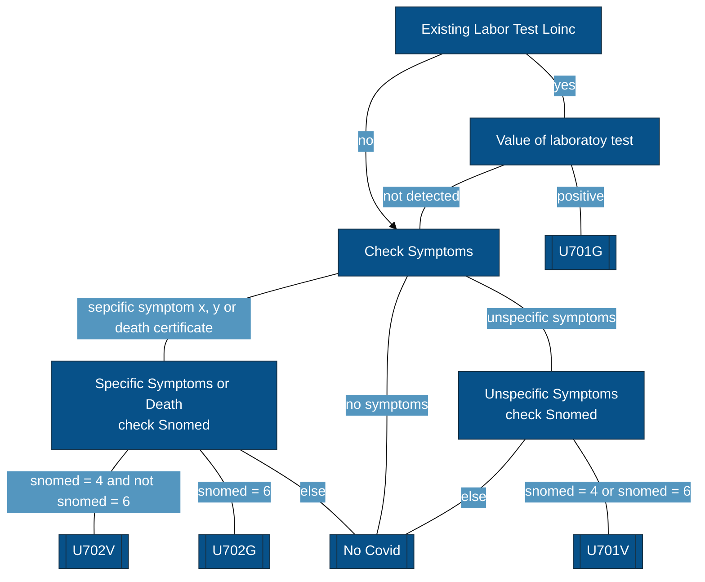

# Projekt Gruppe A Vergleich und Integration von Codierungssystemen im klinischen Kontext (ICD vs. SNOMED CT vs. LOINC)

Group for " Datenmanagement &amp; Archivierung im Umfeld der Forschung"

## Einleitung

## Methoden
**Vorgehen**
- Erarbeitung theoretischer Grundlagen zu ICD, SNOMED-CT und LOINC
- Analyse der zur Verfügung gestellten CSV-Dateien
- Fokusierung auf die Dateien patients.csv, conditions.csv, observations.csv
- Formulierung der Forschungsfrage "Inwiefern kann ein vereinfachtes Mapping zwischen ICD, LOINC und SNOMED CT dazu beitragen, die Konsistenz und Wiederverwendbarkeit klinischer Daten zu verbessern?
"
- Erstellung von Mapping-Tabellen mittels KI-Unterstützung (map_snomed_icd.csv, map_loinc_snomed.csv
- Coding ist in Google Colaboratory erfolgt
- Auswertung der Daten mittels Google Colaboratory
- Prüfung der Datenvalidierung und -qualität in Google Colaboratory
- Beantwortung der Forschungsfrage

**Coding**
- verwendete Bibliotheken: sqlite3, pandas, numpy, os, matplotlib.pyplot
- Einlesen der Dateien map_snomed_icd und map_loinc_snomed.csv in pandas-Data-Frame
- 

## Flowchart Mapping COVID ICD-10

## Ergebnisse

## Diskussion

## Perspektive
