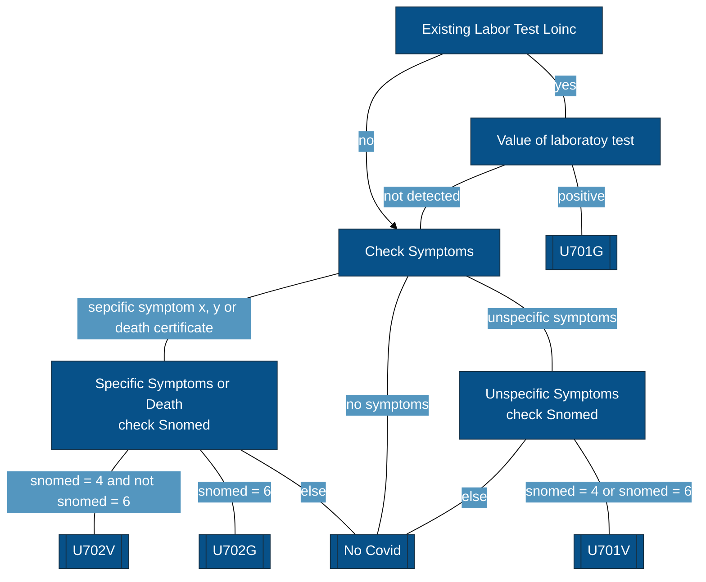
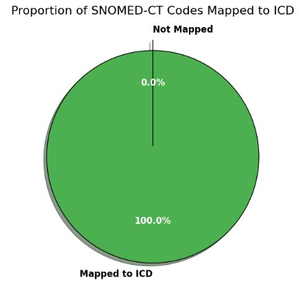
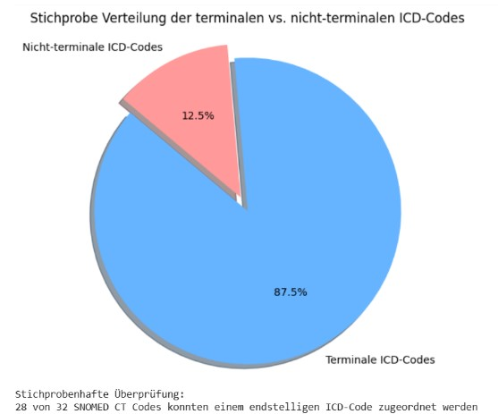
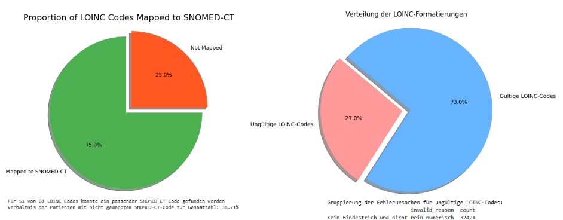
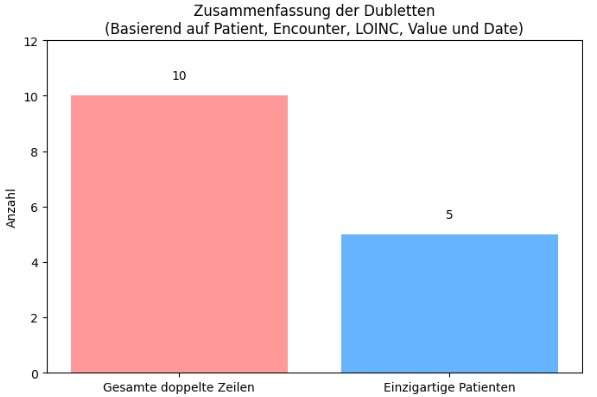

# Projekt Gruppe A Vergleich und Integration von Codierungssystemen im klinischen Kontext (ICD vs. SNOMED CT vs. LOINC)

Group for " Datenmanagement &amp; Archivierung im Umfeld der Forschung"

## Einleitung

## Methoden
- Erarbeitung theoretischer Grundlagen zu ICD, SNOMED-CT und LOINC
- Analyse der zur Verfügung gestellten CSV-Dateien
- Fokusierung auf die Dateien patients.csv, conditions.csv, observations.csv
- Formulierung der Forschungsfrage "Inwiefern kann ein vereinfachtes Mapping zwischen ICD, LOINC und SNOMED CT dazu beitragen, die Konsistenz und Wiederverwendbarkeit klinischer Daten zu verbessern?
"
- Erstellung von Mapping-Tabellen mittels KI-Unterstützung (map_snomed_icd.csv, map_loinc_snomed.csv
- Coding ist in Google Colaboratory erfolgt
- Auswertung der Daten mittels Google Colaboratory
- Prüfung der Datenvalidierung und -qualität in Google Colaboratory
- Beantwortung der Forschungsfrage

## Flowchart Mapping COVID ICD-10

## Ergebnisse

### Datenqualität Mapping von SNOMED-CT und ICD-10
* alle ICD-10 und SNOMED-CT-Codes haben das richtige Format
* alle ICD-10-Codes haben eine Beschreibung
* alle SNOMED-CT und ICD-10 Mappings sind Dublettenfrei
* alle SNOMED-CT und ICD-10 mappings sind konsistent

### Datenqualität Mapping von SNOMED-CT und LOINC
* Kein passender SNOMED-CT für jeden LOINC
* Ungültige Formate: QALY, DALY, QOLS
* Alle Datensätze mit einem gültigen LOINC-Code besitzen auch einen Laborwert
* alle SNOMED-CT und LOINC mappings sind konsistent
* Es wurden 10 Dubletten im Datensatz mit validen LOINC-Codes festgestellt

## Diskussion

### International harmonisierte Daten-Qualitätsstandards

**Definition der drei Hauptkategorien der Datenqualität (Michael G. Kahn et al., 2016):**

1. **Konformität (Conformance)**: Übereinstimmung der Daten mit festgelegten Standards.
2. **Vollständigkeit (Completeness)**: Ausmaß, in dem alle erforderlichen Daten vorhanden sind.
3. **Plausibilität (Plausibility)**: Glaubwürdigkeit und logische Konsistenz der Daten.

| **Kategorie nach Kahn et al.**         | **Datenqualitäts Punkt**                         | **Relevanz** |
|--------------------------------------|--------------------------------|------------------------------------------------------|
| **Conformance (Übereinstimmung)** | Ungemappte Daten | Fehlende Übereinstimmung mit Standards → erschwert Verifikation |
| | Konsistentes Mapping | Einheitliche Kodierung notwendig für interne und externe Validierung |
| | Richtige Formatierung (SNOMED-CT, ICD-10, LOINC) | Korrekte Anwendung erleichtert Verifikation & Validierung |
| **Plausibility (Plausibilität)** | Dublettenkennung | Doppelte Einträge beeinträchtigen Glaubwürdigkeit der Daten |
| **Completeness (Vollständigkeit)** | Liegt eine Beschreibung vor (ICD-10)? | Fehlende Beschreibungen erschweren Verifikation und Validierung |
| | Hat jeder LOINC-Code einen Laborwert? | Fehlende Werte beeinträchtigen die Datenvollständigkeit und deren klinische Nutzbarkeit |

### Chancen / Potenziale

**Eigenes Mapping-Konzept entwickeln:**
- Ermöglicht eine Teilintegration  
- Führt zu einer Verbesserung der Interoperabilität zwischen verschiedenen Systemen  

### Herausforderungen / Einschränkungen

**Lizenzbeschränkungen:**
- Eingeschränkte Nutzung existierender Mapping-Tabellen  

**Direkte 1:1-Zuordnungen:**
- Nur begrenzt möglich (z. B. SNOMED-CT ↔ ICD-10, LOINC ↔ SNOMED-CT)  

**Datenqualitätsstandards:**
- Etablierte Standards sind nur bedingt anwendbar, da die externe Validierung durch Lizenzrestriktionen eingeschränkt ist  

## Perspektive
